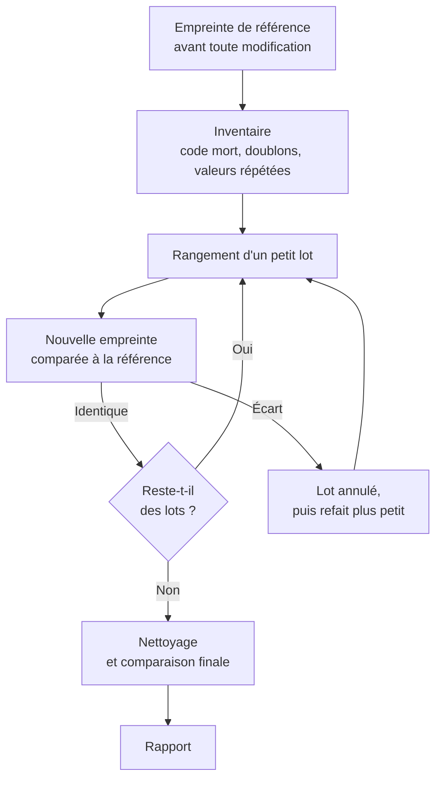

# /refacto : refactoriser avec Claude Code, preuve à l'appui

`/refacto` est un skill pour Claude Code. Il range le code d'une page web, d'une petite application ou d'un script sans rien changer à ce que voit l'utilisateur, et il le prouve par une mesure.

Refactoriser consiste à réécrire du code pour le rendre plus simple à lire et à maintenir, sans modifier son comportement. Toute la difficulté est dans la fin de la phrase. Relire le code ou regarder la page ne suffit pas à garantir que rien n'a bougé : un élément décalé de quelques pixels, un menu qui ne s'ouvre plus sur téléphone ou une couleur qui disparaît en thème sombre passent facilement inaperçus. Ce skill remplace cette vérification à l'œil par une comparaison mesurée, avant et après chaque modification.

## Sommaire

- [Le principe](#le-principe)
- [Ce que la mesure compare](#ce-que-la-mesure-compare)
- [Rangement, correction, décision](#rangement-correction-décision)
- [Le déroulé complet](#le-déroulé-complet)
- [Les outils fournis](#les-outils-fournis)
- [Installation](#installation)
- [Utilisation](#utilisation)
- [Limites](#limites)
- [Structure du dépôt](#structure-du-dépôt)
- [Auteur](#auteur)
- [English summary](#english-summary)

## Le principe

Avant toute modification, le skill relève une **empreinte de référence** de la page. Il range ensuite le code par petits lots. Après chaque lot, il relève une nouvelle empreinte et la compare à la référence. Si un écart apparaît, le lot est annulé et refait plus petit.



La règle est simple : une refactorisation n'est terminée que lorsque l'empreinte finale est identique à la référence.

## Ce que la mesure compare

L'empreinte est relevée dans un vrai navigateur (Chromium, piloté par Puppeteer), page par page.

| Élément comparé | Ce qui est relevé | Ce que cela détecte |
|---|---|---|
| Structure de la page | Le DOM rendu, scripts exclus | Un élément ajouté, supprimé ou déplacé, même invisible |
| Styles | Le style calculé de chaque élément visible (42 propriétés) et de ses pseudo-éléments `::before` et `::after`, ainsi que sa position et sa taille | Une marge, une couleur ou une police modifiée |
| Focus | L'élément qui a le focus clavier | Une navigation au clavier cassée |
| Débordement | La largeur réelle de la page | Un défilement horizontal apparu sur téléphone |
| Rendu | Une capture pleine page, comparée pixel par pixel | Tout écart visible, avec le nombre de pixels touchés et la zone |

Chaque relevé est répété dans toutes les combinaisons suivantes :

| Largeur d'écran | Thème clair | Thème sombre |
|---|---|---|
| 375 px (téléphone) | Mesuré | Mesuré |
| 1440 px (ordinateur) | Mesuré | Mesuré |

Soit quatre relevés pour chaque état de chaque page. Les largeurs se règlent avec l'option `--largeurs`.

Le thème sombre n'est mesuré que si la page le prend en charge ; le skill le détecte seul. Les états (menu ouvert, onglet sélectionné, message d'erreur, formulaire rempli) sont décrits dans un court scénario, rejoué à l'identique avant et après. Un état qui ne figure pas dans le scénario n'est pas protégé : le skill les recense avant de commencer.

Pour que deux mesures successives soient comparables, les animations et transitions sont neutralisées, et le relevé attend le chargement complet des polices. Le skill mesure d'ailleurs la page deux fois avant toute modification : si ces deux mesures diffèrent, la page n'est pas stable et la source d'instabilité est traitée avant de commencer.

### Exemple de rapport

Voici le rapport produit lorsqu'une marge intérieure passe de 12 à 14 pixels sur un bouton :

```
ÉCART chargement @ 375-clair
   - button#menu-bouton:1 { padding : 8px 12px -> 8px 14px }
   - button#menu-bouton:1 { boite : 16 67 61 35 -> 16 67 65 35 }
   - capture : 500 pixel(s) différent(s), zone x 30-80, y 67-101
```

L'écart est localisé (quel élément, quelle propriété, quelle valeur avant et après) et chiffré à l'écran.

## Rangement, correction, décision

Le skill classe chaque constat dans l'une de trois familles. Seule la première est traitée sans votre accord.

| Famille | Définition | Exemples | Traitement |
|---|---|---|---|
| **Rangement** | Modifie le code sans rien changer pour l'utilisateur | Code mort, règles CSS en double, couleur répétée à passer en variable, textes écrits en dur à regrouper dans un fichier de données | Effectué, puis vérifié par l'empreinte |
| **Correction** | Change quelque chose pour l'utilisateur | Bug, défaut d'accessibilité, débordement sur téléphone, couleur qui casse le thème sombre | Listé et soumis à votre validation, puis traité dans un lot séparé |
| **Décision** | Choix inhabituel qui a peut-être une raison | Code qui semble dupliqué volontairement, ordre de chargement particulier | Justification recherchée dans la documentation du projet, puis question posée si elle est introuvable |

Cette séparation évite qu'une correction de bug se glisse dans un rangement et fausse la preuve.

## Le déroulé complet

| Étape | Contenu |
|---|---|
| 0. Situer le code | Lecture de la documentation du projet, distinction entre fichiers sources et fichiers générés, sauvegarde de l'état de départ |
| 1. Poser le filet de sécurité | Vérification de la syntaxe, lancement des tests du projet s'il en a, relevé de l'empreinte de référence |
| 2. Faire l'inventaire | Recherche automatique du code mort et des doublons, lecture du code avec une grille par langage, classement en rangement, correction ou décision |
| 3. Ranger par lots | Du moins risqué au plus risqué : code mort, doublons, variables, données, découpage des fonctions, morceaux communs à plusieurs pages. Comparaison après chaque lot |
| 4. Corrections validées | Uniquement celles que vous avez acceptées, dans un lot à part, vérifiées sur téléphone et sur ordinateur |
| 5. Nettoyage | Suppression de ce que le rangement a rendu inutile et des fichiers de travail, puis comparaison finale |
| 6. Rapport | Ce qui a été rangé, les chiffres (lignes, poids, états comparés), les écarts expliqués, les points en attente |

Aucun commit, aucun envoi vers un dépôt distant et aucune mise en ligne n'a lieu sans votre accord explicite.

## Les outils fournis

Le skill s'appuie sur cinq scripts Node, dans `skills/refacto/scripts/`. Ils fonctionnent aussi seuls, en ligne de commande.

| Script | Rôle | Commande type |
|---|---|---|
| `empreinte.mjs` | Relève et compare l'empreinte d'une page, d'une application ou d'un site entier | `node empreinte.mjs page.html reference.json --etats etats.mjs` |
| `sorties.mjs` | Pour un script (construction de site, export) : compare le code de sortie, le texte affiché et les fichiers produits, à l'octet près | `node sorties.mjs reference.json --commande "node build.mjs" --produit dist` |
| `verifier-syntaxe.mjs` | Vérifie la syntaxe des fichiers JavaScript, des scripts écrits dans les pages HTML, des blocs JSON-LD, des fichiers JSON et Python | `node verifier-syntaxe.mjs mon-projet/` |
| `code-mort.mjs` | Liste les suspects : classes CSS jamais utilisées, variables et animations inutilisées, déclarations en double, fonctions jamais appelées, fichiers orphelins | `node code-mort.mjs mon-projet/ --exclure dist` |
| `auto-test.mjs` | Vérifie que les quatre outils précédents fonctionnent sur votre machine (22 contrôles sur un site de test) | `node auto-test.mjs` |

`empreinte.mjs` et `sorties.mjs` suivent la même logique : au premier lancement, la référence est enregistrée ; aux lancements suivants, la mesure est comparée à cette référence. Le code de sortie vaut 0 si tout est identique et 1 sinon, ce qui permet de les utiliser dans une chaîne d'intégration continue.

Le skill comprend aussi une grille de lecture par langage (`references/catalogue.md`) : HTML, CSS, JavaScript, scripts Node et Python, nœuds Code de n8n. Pour chaque situation, elle indique quoi faire, dans quelle famille la classer, et le piège à éviter.

## Installation

### Prérequis

- [Claude Code](https://claude.com/claude-code)
- Node.js 18 ou plus récent
- Puppeteer, pour les relevés dans le navigateur :

```
npm install -g puppeteer
```

### Par le gestionnaire de plugins de Claude Code

```
/plugin marketplace add Lilcifer75018/skill-refacto
/plugin install refacto@lilian-barty-refacto
```

Redémarrez ensuite Claude Code.

### Installation manuelle

Copiez le dossier `skills/refacto` dans `~/.claude/skills/`.

### Vérification

```
node ~/.claude/skills/refacto/scripts/auto-test.mjs
```

Le résultat attendu est « 22 contrôles, 0 échec(s) ». Après une installation par plugin, le script se trouve dans `~/.claude/plugins/cache/lilian-barty-refacto/refacto/<version>/skills/refacto/scripts/`.

## Utilisation

Dans Claude Code :

```
/refacto ma-page.html
/refacto mon-site/
```

Une demande formulée librement fonctionne aussi : « refactorise ce script », « nettoie le code de cette page ».

Au lancement, le skill affiche un court mode d'emploi, puis déroule les étapes décrites plus haut. Il vous sollicite dans trois cas seulement : une correction ou une décision à valider, des tests déjà en échec avant de commencer, et l'accord final avant tout commit ou mise en ligne.

Le skill couvre les pages HTML, les sites statiques, les petites applications web en JavaScript, les scripts Node et Python, ainsi que le code des nœuds Code de n8n.

## Limites

- Le skill garantit que le code rangé se comporte exactement comme avant. Il ne rend pas le code meilleur sur le fond : un bug présent au départ est toujours là à la fin, mais il vous est signalé.
- Il ne modifie pas le design. L'objectif est précisément que rien ne change à l'écran.
- La preuve ne couvre que les états décrits dans le scénario. Un état oublié n'est pas protégé, d'où le recensement fait avant de commencer.
- Les éléments animés en continu (bandeau qui défile, compteur) peuvent laisser des écarts de moins de 3 pixels. Ils sont signalés comme tels dans le rapport.
- Le skill fonctionne dans Claude Code, sur votre machine. Il ne fonctionne pas dans l'application Claude sur le web, qui ne dispose ni de Node ni d'un navigateur piloté.
- Le skill est rédigé en français.

## Structure du dépôt

```
skill-refacto/
├── .claude-plugin/          manifestes du plugin et de la marketplace
├── skills/refacto/
│   ├── SKILL.md             instructions suivies par Claude
│   ├── references/
│   │   └── catalogue.md     grille de lecture par langage
│   └── scripts/             les cinq outils et un modèle de scénario d'états
├── CHANGELOG.md
├── LICENSE
└── README.md
```

## Auteur

Lilian Barty-Christophe, consultant freelance en IA à Paris. J'installe des outils IA chez des indépendants et dans des entreprises, puis je forme les équipes qui s'en servent.

Ce skill vient de mes propres projets. Sur mon site, une modification de code avait fait disparaître le bouton de changement de thème de 21 pages, alors que la page d'accueil, seule page épargnée, semblait parfaitement en ordre. La méthode décrite ici a depuis servi à refondre le code du site, puis celui d'une application web, vérifiée sur 86 écrans, tous identiques avant et après.

Site : [lilian-barty.fr](https://www.lilian-barty.fr/)

## English summary

`/refacto` is a Claude Code skill for cleaning up the code of web pages, small apps and scripts without breaking them.

Before touching anything, it takes a snapshot of the page: the DOM, the computed style of each element, the focused element and a full screenshot. It does this at 375 and 1440 px, in light and dark mode, and in every state you list (menu open, form filled). After each small batch of changes, it takes the snapshot again and compares, pixel by pixel. If it finds a bug on the way, it tells you and leaves it alone.

It comes with a dead-code finder and a self-test. The skill is in French. MIT license.

## Licence

[MIT](LICENSE)
